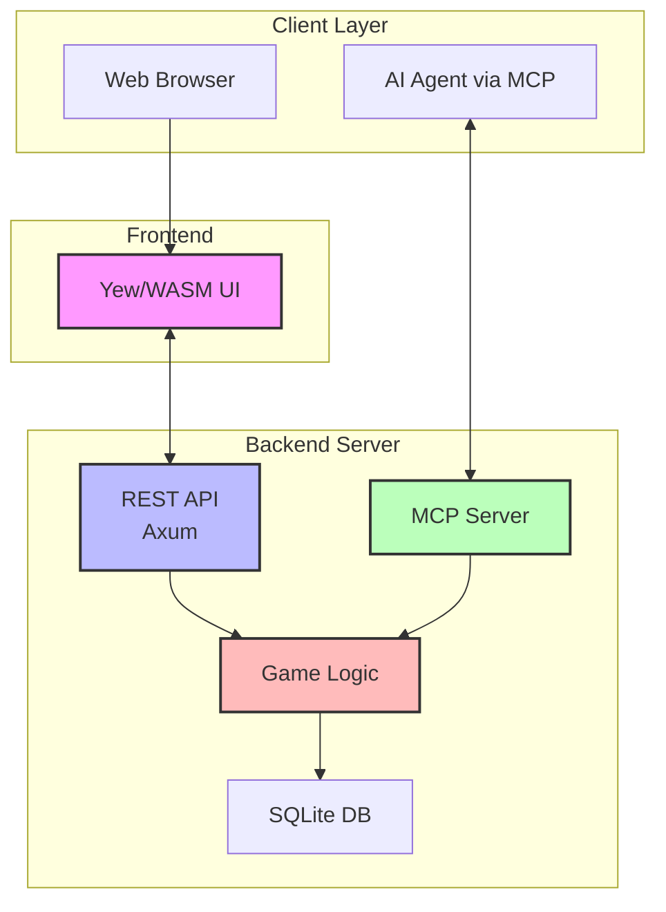

# Game MCP POC Wiki

Welcome to the Tic-Tac-Toe MCP Proof-of-Concept documentation wiki!

## Overview

This project demonstrates a dual-interface tic-tac-toe game that can be played by both humans (via web UI) and AI agents (via Model Context Protocol). The system showcases modern Rust development practices, WebAssembly frontend technology, and AI-agent integration patterns.

### Quick Links

**Architecture Documentation:**
- [[Architecture Overview]] - System architecture and component diagrams
- [[Backend Architecture]] - Server-side components and design
- [[Frontend Architecture]] - WASM/Yew UI implementation
- [[MCP Integration]] - Model Context Protocol interface and tools
- [[Data Flow]] - Request flows and sequence diagrams

**Repository Documentation:**
- [Product Requirements (PRD)](https://github.com/softwarewrighter/game-mcp-poc/blob/main/docs/prd.md)
- [Detailed Design Specification](https://github.com/softwarewrighter/game-mcp-poc/blob/main/docs/design.md)
- [Development Process & TDD Guide](https://github.com/softwarewrighter/game-mcp-poc/blob/main/docs/process.md)
- [Claude AI Instructions](https://github.com/softwarewrighter/game-mcp-poc/blob/main/CLAUDE.md)

## System Architecture



## Technology Stack

| Layer | Technology |
|-------|------------|
| Frontend | Yew + WebAssembly (Rust) |
| Backend | Axum + Rust 2024 |
| Database | SQLite (file-based) |
| Protocol | REST API + MCP |
| Testing | cargo test + wasm-bindgen-test |
| Logging | tracing + console_log |

## Key Features

### For Human Players
- Interactive web-based game board
- Real-time game state updates
- Scrollable event log
- Restart and quit controls
- Taunt messages from AI opponent

### For AI Agents
- View game state via MCP tools
- Make moves through structured tool calls
- Send taunt messages to players
- Restart games programmatically
- Access move history

## Development Workflow

This project follows strict **Test-Driven Development (TDD)**:

1. **Red** - Write failing test
2. **Green** - Implement minimal code to pass
3. **Refactor** - Improve code quality

### Quick Commands

```bash
# Development (hot-reload)
./scripts/dev.sh

# Build production
./scripts/build.sh

# Run tests
cargo test --all

# Format and lint
cargo fmt --all
cargo clippy --all-targets --all-features -- -D warnings
```

## Getting Started

1. Clone the repository
2. Run `./scripts/dev.sh` to start development servers
3. Open http://localhost:8080 in your browser
4. Configure your AI agent to connect via MCP

## Project Structure

```
game-mcp-poc/
├── backend/          # Rust server (REST + MCP + game logic)
├── frontend/         # Yew/WASM web interface
├── shared/           # Common types (Player, Cell, GameState)
├── scripts/          # Build and development scripts
├── docs/             # Detailed documentation
└── wiki/             # This wiki content
```

## Documentation Navigation

Use the sidebar to navigate between different architecture topics, or browse the links above to explore specific areas of the system.

## Contributing

This project requires all code to:
- Pass `cargo fmt` and `cargo clippy` with no warnings
- Have comprehensive tests (no placeholder tests)
- Follow TDD red-green-refactor cycle
- Include detailed commit messages

See the [[Development Process]] guide for detailed contribution guidelines.
